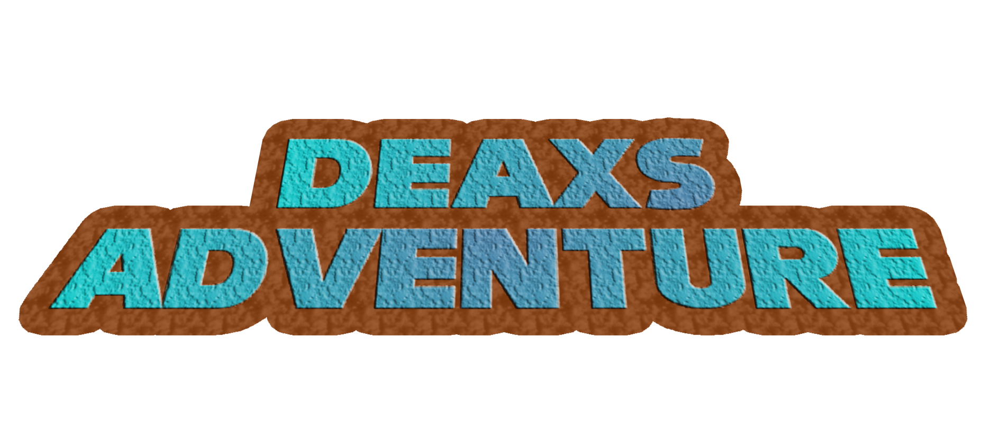

<p align="center">
  
</p>

# The Unofficial DEAXS ADVENTURE Collection
**A custom, offline desktop reader and preservation app for the Deaxs Adventure webcomic.**

A program I made for the **DEAXS ADVENTURE** comic made by my friends so that everyone has an easy access way to read the thing if the worst comes to happen.. or if they just want a fancy way to do it, really.

* **It's an electron app.** Basically just a website transformed into an offline Windows program.
* **Automatic Updates:** The app automatically checks for new comic pages and software improvements if you just press the button.
* **Asset Gallery:** Unlock and view (debatably) high-quality panels and animations as you progress through the story.
* **Listeneable Soundtrack:** Discover and listen to the official soundtrack, with tracks unlocking alongside your achievements.
* **Portable & Standalone:** Unzip the damn thing and go read it right now. Stop reading this README.

## Installation Guide

1. Go to the [Releases](https://github.com/BlairFruit/unofficialdacollection/releases) page.
2. Download the latest `unofficial-deaxsadventure-collection.zip`.
3. Extract the ZIP folder to your desired location.
4. Run `Unofficial Deaxs Adventure Collection.exe` to start it. You should know this.

## Credits & Sources

This project is an unofficial fan-made collection. 

* **Original Comic & Assets:** All assets, story and lore are created by **SpaceF** on [deaxsadventure.com](https://deaxsadventure.com/).
* **Original Source Code:** Based on the website version at [Scinio.github.io](https://github.com/Scinio/Scinio.github.io).
* **Collection Development:** Developed and maintained by BlairFruit.

## Building the Source Code

Ever wanted to see how awful my programming is? No? Here's how you do it anyways.

**Prerequisites:**
* You will need [Node.js](https://nodejs.org/) installed on your machine.

**Setup Instructions:**

1. Clone this repository to your computer:
   ```bash
   git clone [https://github.com/BlairFruit/unofficialdacollection.git](https://github.com/BlairFruit/unofficialdacollection.git)
   ```

2. Open the folder in your terminal and install the required packages:
   ```bash
   npm install
   ```

3. Boot up the app in development mode:
   ```bash
   npm start
   ```

4. Package a fresh Windows `.zip` and `.exe` build:
   ```bash
   npm run build
   ```

Thats it. Have fun.